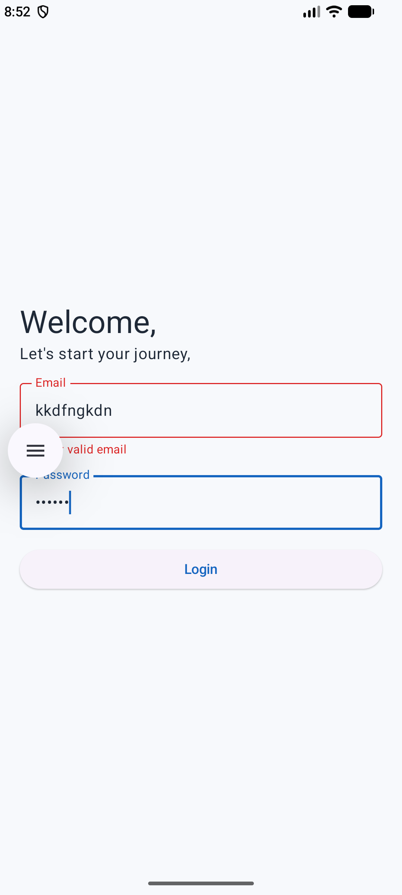
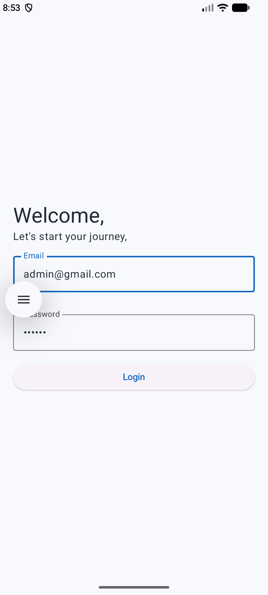
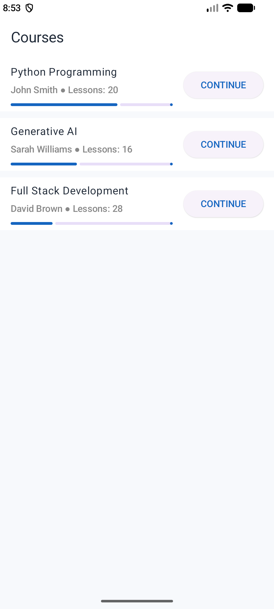
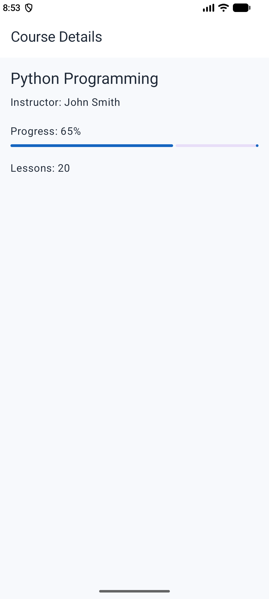

# Learning Dashboard – Android (90% Handwritten and 10% AI)

## Screenshots

  
  
  
  

A small Learning Dashboard application built using **Kotlin and Jetpack Compose**.

The application demonstrates login, course listing, course details, offline support, MVVM architecture, and loading/error state handling.

## Tech Stack

- Kotlin
- Jetpack Compose
- Material 3
- MVVM
- Room Database
- Kotlin Coroutines / StateFlow
- Navigation Compose
- Manual Dependency Injection

## Architecture

The application follows a lightweight **MVVM architecture**:

    Compose UI
         ↓
    ViewModel
         ↓
    Repository
         ↓
    Remote API / Room Database

### Project Structure

    data/
    ├── local/
    │   ├── AppDatabase
    │   ├── CourseDao
    │   └── CourseEntity
    ├── remote/
    ├── repo/
    ├── model/
    └── AppContainer

    navigation/
    └── AppNavigation

    screens/
    ├── login/
    ├── courses/
    └── detail/

    services/
    └── NetworkMonitor

### Responsibilities

- **Screen** – Displays UI and collects state from the ViewModel.
- **ViewModel** – Handles UI state and screen-level logic.
- **Repository** – Acts as the single source of data and handles API/cache selection.
- **API** – Provides remote/mock course data.
- **Room** – Stores courses locally for offline access.
- **AppContainer** – Provides application-level dependencies.

## Offline Support

Courses are cached in Room after a successful API response.

    Internet Available
            ↓
         API Call
            ↓
       Save to Room
            ↓
        Show Courses

    Internet Unavailable
            ↓
        Read from Room
            ↓
        Show Cached Courses

The repository also falls back to the local database when the API request fails, even if the device reports an active network connection.

## Application Flow

    Login
      ↓
    Course Dashboard
      ↓
    Select Course
      ↓
    Course Details

Only the `courseId` is passed through navigation. The Details ViewModel uses that ID to request the required course data through the repository.

## Error & Loading States

The application handles:

- Login validation
- Login loading state
- API loading state
- API failure
- Empty course list
- Offline/cache fallback
- Course not available locally

## Testing

A meaningful unit test is included for course-related business logic, such as progress calculation.

## Production Considerations

For a production application, I would additionally consider:

### Authentication & Security

- Store authentication tokens using Android Keystore / encrypted storage.
- Implement token refresh and session expiry.

### Dependency Injection

- Introduce Hilt/Koin as the application grows.

### Scalability

- Add pagination for large course catalogs.
- Introduce proper API caching and synchronization.
- Add database indexes and efficient queries.
- Add analytics, crash reporting, and monitoring.

### Networking

- Replace the mock API with Retrofit/OkHttp.
- Add structured API error handling and retry policies.

## AI Usage

Approximately **90% of the implementation was written by me and 10% was assisted by AI**.

AI assistance was used for:

- Theme/color setup
- `NetworkMonitor`
- ViewModel factory boilerplate
- Mock course data/list

The architecture, application flow, feature implementation, and remaining code were implemented and reviewed by me. I can explain and modify all parts of the implementation.
